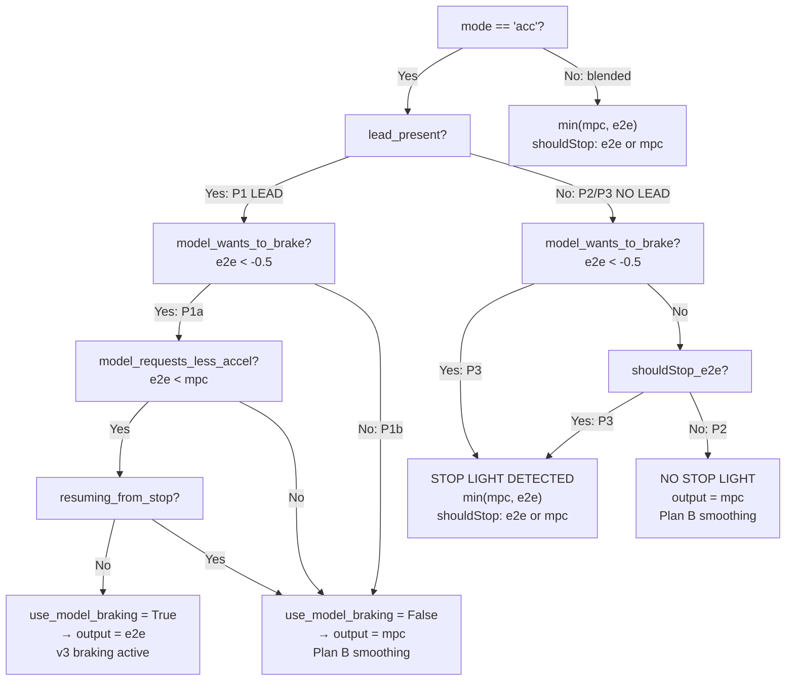

# Comprehensive Longitudinal Planner Fix — Priority-Ordered Implementation

## Honda Pilot 2019 (NIDEC Platform)

**Date:** 2026-05-05
**Status:** ✅ IMPLEMENTED — 2026-05-05
**Fixes:** Slow acceleration + excessive lead-following braking after `stop_light_earlier_detection.md`
**References:**
- [`.claude/reference/acc_earlier_braking_v3.md`](.claude/reference/acc_earlier_braking_v3.md) — v3 earlier braking (TTC=12s, ACC_LEAD_DANGER_FACTOR=0.90)
- [`.claude/plan/acc_smoother_acceleration_plan.md`](.claude/plan/acc_smoother_acceleration_plan.md) — Plan B smoother acceleration
- [`.claude/plan/stop_light_threshold_gate_fix.md`](.claude/plan/stop_light_threshold_gate_fix.md) — threshold gate for stop light detection

---

## 0. Current State Verification

### Already Applied (No Changes Needed)

| System | Parameter | Current Value | Source |
|---|---|---|---|
| **Plan B Smoothing** | `A_CRUISE_MAX_VALS` | `[1.0, 0.8, 0.6, 0.5]` | [`longitudinal_planner.py:21`](selfdrive/controls/lib/longitudinal_planner.py:21) |
| **Plan B Smoothing** | `CRUISE_MAX_ACCEL` | `1.0` | [`long_mpc.py:60`](selfdrive/controls/lib/longitudinal_mpc_lib/long_mpc.py:60) |
| **Plan B Smoothing** | `J_EGO_COST` | `10.0` | [`long_mpc.py:38`](selfdrive/controls/lib/longitudinal_mpc_lib/long_mpc.py:38) |
| **Plan B Smoothing** | `A_CHANGE_COST` | `400` | [`long_mpc.py:39`](selfdrive/controls/lib/longitudinal_mpc_lib/long_mpc.py:39) |
| **Plan B Smoothing** | `accel_clip` rate | `±0.03` | [`longitudinal_planner.py:223`](selfdrive/controls/lib/longitudinal_planner.py:223) |
| **v3 Braking** | `ACC_LEAD_DANGER_FACTOR` | `0.90` | [`long_mpc.py:43`](selfdrive/controls/lib/longitudinal_mpc_lib/long_mpc.py:43) |
| **v3 Braking** | TTC threshold | `12.0s` | [`long_mpc.py:376`](selfdrive/controls/lib/longitudinal_mpc_lib/long_mpc.py:376) |

### Current Output Selection Logic (lines 179-220)

```python
if mode == 'acc' or not self.mlsim:
    lead_present = self.mpc.lead_relevant
    model_is_not_accelerating = output_a_target_e2e <= 0.0    # ← TOO PERMISSIVE
    model_requests_less_accel = output_a_target_e2e < output_a_target_mpc
    # ... resuming_from_stop ...

    if lead_present:
        use_model_braking = (
            model_is_not_accelerating      # ← PROBLEM: -0.1 passes this
            and model_requests_less_accel
            and not resuming_from_stop
        )
        if use_model_braking:
            output_a_target = output_a_target_e2e
        else:
            output_a_target = output_a_target_mpc    # ← Plan B applies here
    else:
        output_a_target = min(output_a_target_mpc, output_a_target_e2e)  # ← PROBLEM
else:
    output_a_target = min(output_a_target_mpc, output_a_target_e2e)  # blended: OK
```

---

## 1. Priority Hierarchy & Implementation

### Priority 1: LEAD PRESENT PATH

**1a. Lead slower/stopped → Apply v3 braking with threshold gate**

The v3 braking parameters (`ACC_LEAD_DANGER_FACTOR=0.90`, TTC=12s) are already active in the MPC. They control:
- When `lead_relevant` becomes True (TTC < 12s)
- How aggressively MPC itself brakes (tighter danger zone)

The fix: Replace `model_is_not_accelerating` (≤0.0) with `model_wants_to_brake` (< -0.5) so model conservatism doesn't trigger unnecessary braking.

**1b. Lead faster → Apply Plan B smoother acceleration**

When `use_model_braking` is False (lead faster, or model not braking), the fallback is `output_a_target_mpc` which already flows through Plan B caps. No code change needed — this path already works correctly.

### Priority 2: NO-LEAD + NO STOP LIGHT → Plan B Smoothing

When model shows no braking intent (`output_a_target_e2e >= -0.5` and `not output_should_stop_e2e`), use pure MPC output. Plan B parameters (`A_CRUISE_MAX_VALS`, `CRUISE_MAX_ACCEL`, rate limits) provide smooth acceleration.

### Priority 3: NO-LEAD + STOP LIGHT → Threshold Gate

When model shows clear braking intent (`output_a_target_e2e < -0.5`) or explicit stop signal (`output_should_stop_e2e`), use `min(mpc, e2e)` for immediate deceleration.

---

## 2. Code Changes

### File: [`selfdrive/controls/lib/longitudinal_planner.py`](selfdrive/controls/lib/longitudinal_planner.py)

#### 2.1 Add threshold constant (after line 25)

```python
MIN_ALLOW_THROTTLE_SPEED = 2.5
MODEL_BRAKE_THRESHOLD = -0.5  # m/s², model must want at least this much decel to override MPC
```

#### 2.2 Replace output selection block (lines 179-220)

**Current (lines 179-220):**
```python
    if mode == 'acc' or not self.mlsim:
      # Conditional model braking: model overrides MPC ONLY when ALL are true:
      #   1. A braking-relevant lead is present (self.mpc.lead_relevant)
      #   2. Model is not requesting positive acceleration (coasting or braking)
      #   3. Model requests less acceleration than MPC (more braking/coasting)
      #   4. Not resuming from stop with lead pulling away (preserve acceleration)
      # This allows gentle model decel/coasting for earlier braking when a lead
      # is present, while preserving ACC acceleration when the model wants to go.
      lead_present = self.mpc.lead_relevant
      model_is_not_accelerating = output_a_target_e2e <= 0.0
      model_requests_less_accel = output_a_target_e2e < output_a_target_mpc

      # Don't let model braking override acceleration when resuming from a stop
      # and the lead is pulling away (vLead > v_ego). Exception: lead is stopped
      # or very close — then braking still takes priority.
      v_ego = sm['carState'].vEgo
      lead_moving_away = (
          (sm['radarState'].leadOne.status and sm['radarState'].leadOne.vLead > v_ego) or
          (sm['radarState'].leadTwo.status and sm['radarState'].leadTwo.vLead > v_ego)
      )
      resuming_from_stop = v_ego < MIN_ALLOW_THROTTLE_SPEED and lead_moving_away

      # No-lead: model decel always available (same as blended mode behavior).
      # With-lead: gated use_model_braking for safe lead-following (v3).
      if lead_present:
        use_model_braking = (
            model_is_not_accelerating
            and model_requests_less_accel
            and not resuming_from_stop
        )
        if use_model_braking:
          output_a_target = output_a_target_e2e
          self.output_should_stop = output_should_stop_mpc
        else:
          output_a_target = output_a_target_mpc
          self.output_should_stop = output_should_stop_mpc
      else:
        output_a_target = min(output_a_target_mpc, output_a_target_e2e)
        self.output_should_stop = output_should_stop_e2e or output_should_stop_mpc
    else:
      output_a_target = min(output_a_target_mpc, output_a_target_e2e)
      self.output_should_stop = output_should_stop_e2e or output_should_stop_mpc
```

**Replace with:**
```python
    if mode == 'acc' or not self.mlsim:
      # Priority-ordered output selection for ACC mode:
      #
      # P1: LEAD PRESENT
      #   P1a: Lead slower/stopped → v3 braking with threshold gate
      #        (ACC_LEAD_DANGER_FACTOR=0.90, TTC=12s in MPC; model override
      #         only when model wants >0.5 m/s² decel)
      #   P1b: Lead faster → Plan B smoother acceleration
      #        (use_model_braking=False → pure MPC with A_CRUISE_MAX_VALS caps)
      #
      # P2: NO LEAD + NO STOP LIGHT → Plan B smoother acceleration
      #     (model not braking → pure MPC with smoothing caps)
      #
      # P3: NO LEAD + STOP LIGHT → threshold-gated min(mpc, e2e)
      #     (model braking >0.5 m/s² or shouldStop → immediate model decel)
      #
      lead_present = self.mpc.lead_relevant
      model_wants_to_brake = output_a_target_e2e < MODEL_BRAKE_THRESHOLD
      model_requests_less_accel = output_a_target_e2e < output_a_target_mpc

      # Don't let model braking override acceleration when resuming from a stop
      # and the lead is pulling away (vLead > v_ego).
      v_ego = sm['carState'].vEgo
      lead_moving_away = (
          (sm['radarState'].leadOne.status and sm['radarState'].leadOne.vLead > v_ego) or
          (sm['radarState'].leadTwo.status and sm['radarState'].leadTwo.vLead > v_ego)
      )
      resuming_from_stop = v_ego < MIN_ALLOW_THROTTLE_SPEED and lead_moving_away

      if lead_present:
        # P1a: Lead slower/stopped — v3 braking with threshold gate
        # P1b: Lead faster — use_model_braking=False → pure MPC (Plan B)
        use_model_braking = (
            model_wants_to_brake
            and model_requests_less_accel
            and not resuming_from_stop
        )
        if use_model_braking:
          output_a_target = output_a_target_e2e
          self.output_should_stop = output_should_stop_mpc
        else:
          output_a_target = output_a_target_mpc
          self.output_should_stop = output_should_stop_mpc
      else:
        # P2: No stop light → pure MPC with Plan B smoothing
        # P3: Stop light detected → threshold-gated min(mpc, e2e)
        if model_wants_to_brake or output_should_stop_e2e:
          output_a_target = min(output_a_target_mpc, output_a_target_e2e)
          self.output_should_stop = output_should_stop_e2e or output_should_stop_mpc
        else:
          output_a_target = output_a_target_mpc
          self.output_should_stop = output_should_stop_mpc
    else:
      output_a_target = min(output_a_target_mpc, output_a_target_e2e)
      self.output_should_stop = output_should_stop_e2e or output_should_stop_mpc
```

---

## 3. Decision Flow Diagram



---

## 4. Behavioral Trace Matrix

| # | Scenario | lead_present | e2e accel | e2e stop | Path | Output | Behavior |
|---|----------|:---:|------|:---:|---|---|---|
| 1 | Open road, no lead | False | -0.1 | False | P2 | MPC + Plan B | Smooth acceleration to cruise |
| 2 | Red light ahead, early | False | -0.8 | False | P3 | min(mpc, -0.8) | Gentle early decel |
| 3 | Red light ahead, close | False | -2.0 | True | P3 | min(mpc, -2.0) | Strong braking + stop |
| 4 | Green after stop | False | +0.5 | False | P2 | MPC + Plan B | Smooth resume |
| 5 | Lead faster, following | True | -0.3 | False | P1b | MPC + Plan B | Normal following, smooth |
| 6 | Lead slower, braking | True | -1.5 | False | P1a | e2e (-1.5) | Early braking preserved |
| 7 | Lead stopped ahead | True | -2.0 | True | P1a | e2e (-2.0) | v3 braking + stop |
| 8 | Resume, lead pulling away | True | -0.3 | False | P1b | MPC + Plan B | Blocked by resuming_from_stop |
| 9 | Curve, no lead | False | -0.6 | False | P3 | min(mpc, -0.6) | Model curve decel used |
| 10 | Downhill, no lead | False | -0.4 | False | P2 | MPC + Plan B | MPC handles coasting |

---

## 5. Implementation Steps

1. Add `MODEL_BRAKE_THRESHOLD = -0.5` constant after line 25 in [`longitudinal_planner.py`](selfdrive/controls/lib/longitudinal_planner.py:25)
2. Replace the entire output selection block (lines 179-220) with the new priority-ordered version
3. Verify no other files need changes (v3 braking and Plan B parameters already applied)

### Files NOT changed:
- [`long_mpc.py`](selfdrive/controls/lib/longitudinal_mpc_lib/long_mpc.py) — v3 braking + Plan B params already correct
- [`longcontrol.py`](selfdrive/controls/lib/longcontrol.py) — state machine unchanged
- [`drive_helpers.py`](selfdrive/controls/lib/drive_helpers.py) — helpers unchanged
- Blended mode path — completely untouched
