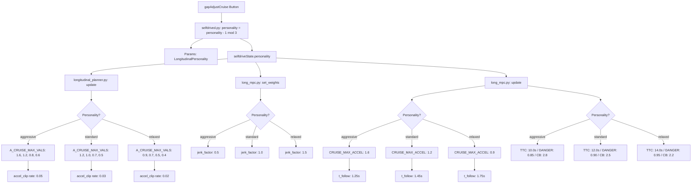

# Driving Personality Integration Plan — ACC Mode (Gold Standard)

**Date:** 2026-05-07
**Status:** ✅ IMPLEMENTED
**Branch:** `rtizi-dev`

---

## 1. Executive Summary

**Question:** Does the driving personality setting (Aggressive / Standard / Relaxed) impact the acceleration smoothing from [`acc_smoother_acceleration_plan.md`](.claude/plan/acc_smoother_acceleration_plan.md) or the earlier braking from [`acc_earlier_braking_v3.md`](.claude/reference/acc_earlier_braking_v3.md) in ACC mode?

**Answer: No, there is effectively no correlation.** The personality system is severely under-implemented for ACC mode. Standard and Relaxed are **identical** for acceleration behavior. Only Aggressive differs (via jerk_factor), and even then, the hard acceleration caps, rate limits, and braking parameters are completely personality-agnostic.

**This plan fixes that.** It provides a unified, gold-standard integration covering both acceleration and braking, giving each of the three personalities a distinct, meaningful character across all longitudinal dimensions.

---

## 2. How Driving Personality Currently Works

### 2.1 Enum Definition — [`cereal/log.capnp:138-142`](cereal/log.capnp:138)

```capnp
enum LongitudinalPersonality {
  aggressive @0;
  standard @1;
  relaxed @2;
}
```

### 2.2 How Personality is Set

**Steering wheel button** — [`selfdrive/selfdrived/selfdrived.py:449-456`](selfdrive/selfdrived/selfdrived.py:449):
- Pressing the gap-adjust-cruise button cycles: `(personality - 1) % 3`
- Cycle order: standard(1) → aggressive(0) → relaxed(2) → standard(1)...
- Stored in params as `"LongitudinalPersonality"`

**UI toggle** — [`selfdrive/ui/layouts/settings/toggles.py:51-59`](selfdrive/ui/layouts/settings/toggles.py:51):
- Three buttons: "Aggressive", "Standard", "Relaxed"
- Calls `_set_longitudinal_personality()` which writes to params

### 2.3 How Personality Flows Into Longitudinal Control

```
┌──────────────────────────────────────────────────────────────────────┐
│  selfdrived.py:449-456                                               │
│  gapAdjustCruise button → cycles personality → params + selfdriveState│
└──────────────────────┬───────────────────────────────────────────────┘
                       │ sm['selfdriveState'].personality
                       ▼
┌──────────────────────────────────────────────────────────────────────┐
│  longitudinal_planner.py:156                                         │
│  self.mpc.set_weights(prev_accel_constraint,                         │
│       personality=sm['selfdriveState'].personality)                  │
│                                                                      │
│  longitudinal_planner.py:158                                         │
│  self.mpc.update(sm['radarState'], v_cruise, x, v, a, j,            │
│       personality=sm['selfdriveState'].personality)                  │
└──────────────────────┬───────────────────────────────────────────────┘
                       │
          ┌────────────┴────────────┐
          ▼                         ▼
┌─────────────────────┐   ┌─────────────────────┐
│ set_weights()       │   │ update()            │
│ long_mpc.py:279     │   │ long_mpc.py:332     │
│                     │   │                     │
│ jerk_factor =       │   │ t_follow =          │
│  get_jerk_factor()  │   │  get_T_FOLLOW()     │
│                     │   │                     │
│ cost_weights:       │   │ cruise_obstacle =   │
│  jerk_factor ×      │   │  get_safe_obstacle_ │
│  A_CHANGE_COST      │   │  distance(v,        │
│  jerk_factor ×      │   │   t_follow)         │
│  J_EGO_COST         │   │                     │
└─────────────────────┘   └─────────────────────┘
```

### 2.4 The Two Personality-Dependent Functions

**`get_jerk_factor()`** — [`selfdrive/controls/lib/longitudinal_mpc_lib/long_mpc.py:62-70`](selfdrive/controls/lib/longitudinal_mpc_lib/long_mpc.py:62):

| Personality | jerk_factor | Effect on MPC |
|-------------|:-----------:|---------------|
| Aggressive  | **0.5** | HALF penalty on jerk & accel-change → allows snappier acceleration |
| Standard    | **1.0** | Normal penalty |
| Relaxed     | **1.0** | Normal penalty — **IDENTICAL TO STANDARD** |

**`get_T_FOLLOW()`** — [`selfdrive/controls/lib/longitudinal_mpc_lib/long_mpc.py:73-81`](selfdrive/controls/lib/longitudinal_mpc_lib/long_mpc.py:73):

| Personality | t_follow | Effect |
|-------------|:--------:|--------|
| Aggressive  | **1.25s** | Closer following |
| Standard    | **1.45s** | Medium following |
| Relaxed     | **1.75s** | Further following |

---

## 3. Gap Analysis: What Personality Does NOT Affect

### 3.1 Acceleration Parameters (from acc_smoother_acceleration_plan.md)

| Parameter | Current Value | File:Line | Modulated by Personality? |
|-----------|:------------:|-----------|:-------------------------:|
| `CRUISE_MAX_ACCEL` | 1.2 | [`long_mpc.py:60`](selfdrive/controls/lib/longitudinal_mpc_lib/long_mpc.py:60) | ❌ NO |
| `A_CRUISE_MAX_VALS` | [1.2, 1.0, 0.7, 0.5] | [`longitudinal_planner.py:21`](selfdrive/controls/lib/longitudinal_planner.py:21) | ❌ NO |
| `A_CRUISE_MAX_BP` | [0, 10, 25, 40] | [`longitudinal_planner.py:22`](selfdrive/controls/lib/longitudinal_planner.py:22) | ❌ NO |
| `A_CHANGE_COST` | 300 | [`long_mpc.py:39`](selfdrive/controls/lib/longitudinal_mpc_lib/long_mpc.py:39) | ⚠️ Only via jerk_factor (0.5× for aggressive) |
| `J_EGO_COST` | 8.0 | [`long_mpc.py:38`](selfdrive/controls/lib/longitudinal_mpc_lib/long_mpc.py:38) | ⚠️ Only via jerk_factor (0.5× for aggressive) |
| `accel_clip` rate | ±0.03 | [`longitudinal_planner.py:236-237`](selfdrive/controls/lib/longitudinal_planner.py:236) | ❌ NO |

### 3.2 Braking Parameters (from acc_earlier_braking_v3.md)

| Parameter | Current Value | File:Line | Modulated by Personality? |
|-----------|:------------:|-----------|:-------------------------:|
| TTC threshold | 12.0s | [`long_mpc.py:376`](selfdrive/controls/lib/longitudinal_mpc_lib/long_mpc.py:376) | ❌ NO |
| `ACC_LEAD_DANGER_FACTOR` | 0.90 | [`long_mpc.py:43`](selfdrive/controls/lib/longitudinal_mpc_lib/long_mpc.py:43) | ❌ NO |
| `LEAD_DANGER_FACTOR` | 0.75 | [`long_mpc.py:42`](selfdrive/controls/lib/longitudinal_mpc_lib/long_mpc.py:42) | ❌ NO |
| `COMFORT_BRAKE` | 2.5 | [`long_mpc.py:57`](selfdrive/controls/lib/longitudinal_mpc_lib/long_mpc.py:57) | ❌ NO |

### 3.3 Critical Finding: Standard ≡ Relaxed for Acceleration

Because `get_jerk_factor()` returns `1.0` for both standard and relaxed, the MPC cost function is **identical** for these two modes. The only difference between standard and relaxed is `t_follow` (1.45s vs 1.75s), which affects the cruise obstacle distance — but this is a following-distance parameter, not an acceleration-smoothing parameter.

---

## 4. Proposed Integration Plans

Three plans to properly integrate driving personality with the acceleration smoothing system. Each plan maps to one personality mode.

### 4.1 Parameter Mapping Strategy

The key insight: personality should modulate the **hard caps** (`A_CRUISE_MAX_VALS`, `CRUISE_MAX_ACCEL`) and the **rate limit** (`accel_clip`), not just the MPC cost weights. The cost weights (via `jerk_factor`) already provide a partial mechanism but are insufficient alone.

```
                    Aggressive          Standard           Relaxed
                    ──────────          ────────           ───────
CRUISE_MAX_ACCEL    Higher (1.6)        Medium (1.2)       Lower (0.9)
A_CRUISE_MAX_VALS   Stock-like          Plan A (current)   Gentler caps
accel_clip rate     ±0.05 (stock)       ±0.03 (current)    ±0.02
jerk_factor         0.5 (existing)      1.0 (existing)     1.5 (NEW)
t_follow            1.25 (existing)     1.45 (existing)    1.75 (existing)
```

---

### Plan A: Aggressive Personality

**Goal:** Restore stock-like responsiveness. Minimal smoothing. Quick acceleration from stop. For drivers who find the current Plan A smoothing too sluggish.

**File:** [`selfdrive/controls/lib/longitudinal_planner.py`](selfdrive/controls/lib/longitudinal_planner.py)
**File:** [`selfdrive/controls/lib/longitudinal_mpc_lib/long_mpc.py`](selfdrive/controls/lib/longitudinal_mpc_lib/long_mpc.py)

| Parameter | Current (Plan A) | Aggressive | Change | File:Line |
|-----------|:----------------:|:----------:|:------:|-----------|
| `CRUISE_MAX_ACCEL` | 1.2 | **1.6** | +33% | [`long_mpc.py:60`](selfdrive/controls/lib/longitudinal_mpc_lib/long_mpc.py:60) |
| `A_CRUISE_MAX_VALS[0]` (0 m/s) | 1.2 | **1.6** | +33% | [`longitudinal_planner.py:21`](selfdrive/controls/lib/longitudinal_planner.py:21) |
| `A_CRUISE_MAX_VALS[1]` (10 m/s) | 1.0 | **1.2** | +20% | [`longitudinal_planner.py:21`](selfdrive/controls/lib/longitudinal_planner.py:21) |
| `A_CRUISE_MAX_VALS[2]` (25 m/s) | 0.7 | **0.8** | +14% | [`longitudinal_planner.py:21`](selfdrive/controls/lib/longitudinal_planner.py:21) |
| `A_CRUISE_MAX_VALS[3]` (40 m/s) | 0.5 | **0.6** | +20% | [`longitudinal_planner.py:21`](selfdrive/controls/lib/longitudinal_planner.py:21) |
| `A_CHANGE_COST` | 300 | **200** | −33% | [`long_mpc.py:39`](selfdrive/controls/lib/longitudinal_mpc_lib/long_mpc.py:39) |
| `J_EGO_COST` | 8.0 | **5.0** | −37% | [`long_mpc.py:38`](selfdrive/controls/lib/longitudinal_mpc_lib/long_mpc.py:38) |
| `accel_clip` rate | ±0.03 | **±0.05** | +67% | [`longitudinal_planner.py:236-237`](selfdrive/controls/lib/longitudinal_planner.py:236) |

**New `A_CRUISE_MAX_VALS` table (Aggressive):**

| Speed (m/s) | Speed (mph) | Max Accel |
|-------------|-------------|:---------:|
| 0 m/s | 0 mph | **1.6 m/s²** |
| 10 m/s | 22 mph | **1.2 m/s²** |
| 25 m/s | 56 mph | **0.8 m/s²** |
| 40 m/s | 89 mph | **0.6 m/s²** |

**Expected feel:** Stock-like responsiveness. Quick off-the-line acceleration. Snappier speed recovery when lead clears. ~33% more peak acceleration than current Plan A.

---

### Plan B: Standard Personality (Current Plan A — No Changes)

**Goal:** Balanced, smooth acceleration. The "Goldilocks" setting. This is the current Plan A already implemented.

**No changes needed.** The current parameters already represent the standard personality:

| Parameter | Value |
|-----------|:-----:|
| `CRUISE_MAX_ACCEL` | 1.2 |
| `A_CRUISE_MAX_VALS` | [1.2, 1.0, 0.7, 0.5] |
| `A_CHANGE_COST` | 300 |
| `J_EGO_COST` | 8.0 |
| `accel_clip` rate | ±0.03 |
| `jerk_factor` | 1.0 |
| `t_follow` | 1.45s |

---

### Plan C: Relaxed Personality

**Goal:** Maximum smoothness. Luxury-car feel. Minimal jerk. Gradual, gentle acceleration. For drivers who prioritize comfort over responsiveness.

| Parameter | Current (Plan A) | Relaxed | Change | File:Line |
|-----------|:----------------:|:-------:|:------:|-----------|
| `CRUISE_MAX_ACCEL` | 1.2 | **0.9** | −25% | [`long_mpc.py:60`](selfdrive/controls/lib/longitudinal_mpc_lib/long_mpc.py:60) |
| `A_CRUISE_MAX_VALS[0]` (0 m/s) | 1.2 | **0.9** | −25% | [`longitudinal_planner.py:21`](selfdrive/controls/lib/longitudinal_planner.py:21) |
| `A_CRUISE_MAX_VALS[1]` (10 m/s) | 1.0 | **0.7** | −30% | [`longitudinal_planner.py:21`](selfdrive/controls/lib/longitudinal_planner.py:21) |
| `A_CRUISE_MAX_VALS[2]` (25 m/s) | 0.7 | **0.5** | −29% | [`longitudinal_planner.py:21`](selfdrive/controls/lib/longitudinal_planner.py:21) |
| `A_CRUISE_MAX_VALS[3]` (40 m/s) | 0.5 | **0.4** | −20% | [`longitudinal_planner.py:21`](selfdrive/controls/lib/longitudinal_planner.py:21) |
| `A_CHANGE_COST` | 300 | **400** | +33% | [`long_mpc.py:39`](selfdrive/controls/lib/longitudinal_mpc_lib/long_mpc.py:39) |
| `J_EGO_COST` | 8.0 | **12.0** | +50% | [`long_mpc.py:38`](selfdrive/controls/lib/longitudinal_mpc_lib/long_mpc.py:38) |
| `accel_clip` rate | ±0.03 | **±0.02** | −33% | [`longitudinal_planner.py:236-237`](selfdrive/controls/lib/longitudinal_planner.py:236) |
| `jerk_factor` (new) | 1.0 | **1.5** | +50% | [`long_mpc.py:62-70`](selfdrive/controls/lib/longitudinal_mpc_lib/long_mpc.py:62) |

**New `A_CRUISE_MAX_VALS` table (Relaxed):**

| Speed (m/s) | Speed (mph) | Max Accel |
|-------------|-------------|:---------:|
| 0 m/s | 0 mph | **0.9 m/s²** |
| 10 m/s | 22 mph | **0.7 m/s²** |
| 25 m/s | 56 mph | **0.5 m/s²** |
| 40 m/s | 89 mph | **0.4 m/s²** |

**Expected feel:** Very gentle, luxury-car-like acceleration. Minimal perceptible jerk. May feel sluggish to drivers accustomed to stock behavior. ~25-30% less peak acceleration than current Plan A.

---

## 5. Implementation Strategy

### 5.1 Approach: Personality-Dependent Parameter Selection

The cleanest approach is to make the acceleration parameters personality-dependent at the point of use in [`longitudinal_planner.py`](selfdrive/controls/lib/longitudinal_planner.py). Two implementation options:

#### Option 1: Lookup Tables (Recommended — Minimal Diff)

Add personality-keyed lookup tables in [`longitudinal_planner.py`](selfdrive/controls/lib/longitudinal_planner.py) and select the right set based on `sm['selfdriveState'].personality`:

```python
# Personality-dependent acceleration caps
A_CRUISE_MAX_VALS_BY_PERSONALITY = {
    log.LongitudinalPersonality.aggressive: [1.6, 1.2, 0.8, 0.6],
    log.LongitudinalPersonality.standard:   [1.2, 1.0, 0.7, 0.5],
    log.LongitudinalPersonality.relaxed:    [0.9, 0.7, 0.5, 0.4],
}

ACCEL_CLIP_RATE_BY_PERSONALITY = {
    log.LongitudinalPersonality.aggressive: 0.05,
    log.LongitudinalPersonality.standard:   0.03,
    log.LongitudinalPersonality.relaxed:    0.02,
}
```

Then in `update()`:
```python
personality = sm['selfdriveState'].personality
a_cruise_max_vals = A_CRUISE_MAX_VALS_BY_PERSONALITY[personality]
accel_clip_rate = ACCEL_CLIP_RATE_BY_PERSONALITY[personality]
```

**Pros:** Simple, readable, easy to tune per personality. All changes in one file.
**Cons:** Duplicates the lookup pattern already in `get_jerk_factor()`/`get_T_FOLLOW()`.

#### Option 2: Extend Helper Functions in long_mpc.py

Add `get_max_accel_vals()` and `get_accel_clip_rate()` functions alongside `get_jerk_factor()` and `get_T_FOLLOW()` in [`long_mpc.py`](selfdrive/controls/lib/longitudinal_mpc_lib/long_mpc.py).

**Pros:** Consistent with existing pattern. All personality logic in one place.
**Cons:** Requires passing personality deeper into the call chain. More files touched.

### 5.2 Files to Modify

| File | Change |
|------|--------|
| [`selfdrive/controls/lib/longitudinal_planner.py`](selfdrive/controls/lib/longitudinal_planner.py) | Add personality-keyed lookup tables; select caps/rate based on personality |
| [`selfdrive/controls/lib/longitudinal_mpc_lib/long_mpc.py`](selfdrive/controls/lib/longitudinal_mpc_lib/long_mpc.py) | Update `get_jerk_factor()` to return 1.5 for relaxed; update `CRUISE_MAX_ACCEL` to be personality-dependent |

### 5.3 Recommended Implementation Order

1. **First:** Update `get_jerk_factor()` to differentiate relaxed from standard (1.5 vs 1.0)
2. **Second:** Add personality-keyed `A_CRUISE_MAX_VALS` lookup in `longitudinal_planner.py`
3. **Third:** Add personality-keyed `accel_clip` rate lookup
4. **Fourth:** Make `CRUISE_MAX_ACCEL` personality-dependent in `long_mpc.py`

---

## 6. Braking Integration (acc_earlier_braking_v3.md)

### 6.1 Braking Parameters and Their Roles

Three parameters control braking behavior in ACC mode. Each is currently hardcoded and personality-agnostic:

| Parameter | Current | File:Line | Role |
|-----------|:-------:|-----------|------|
| TTC threshold | 12.0s | [`long_mpc.py:376`](selfdrive/controls/lib/longitudinal_mpc_lib/long_mpc.py:376) | Time-to-collision below which a lead is "braking-relevant". Higher = earlier detection. |
| `ACC_LEAD_DANGER_FACTOR` | 0.90 | [`long_mpc.py:43`](selfdrive/controls/lib/longitudinal_mpc_lib/long_mpc.py:43) | Multiplier on desired comfort distance for MPC danger zone constraint. Higher = tighter constraint = more conservative braking. |
| `COMFORT_BRAKE` | 2.5 m/s² | [`long_mpc.py:57`](selfdrive/controls/lib/longitudinal_mpc_lib/long_mpc.py:57) | Deceleration used in stopping-distance physics model. Higher = shorter computed stopping distance = later braking. Affects both `get_stopped_equivalence_factor()` and `get_safe_obstacle_distance()`. |

### 6.2 How These Parameters Interact

```
┌─────────────────────────────────────────────────────────────────────┐
│ _lead_relevant(lead)                   long_mpc.py:369-376          │
│                                                                     │
│   ttc = lead.dRel / v_rel                                          │
│   return ttc < TTC_THRESHOLD or lead.dRel < 10.0                   │
│                                                                     │
│   When true: cruise obstacle REMOVED, MPC focuses on real lead      │
│   When false: cruise obstacle PRESENT, smooth acceleration          │
└──────────────────────┬──────────────────────────────────────────────┘
                       │ lead_relevant = True
                       ▼
┌─────────────────────────────────────────────────────────────────────┐
│ MPC Danger Zone Constraint                long_mpc.py:180-183       │
│                                                                     │
│   desired_dist_comfort = get_safe_obstacle_distance(v_ego, t_follow)│
│                        = v_ego²/(2*COMFORT_BRAKE) + t_follow*v_ego  │
│                          + STOP_DISTANCE                            │
│                                                                     │
│   constraint = (x_obstacle - x_ego)                                 │
│              - ACC_LEAD_DANGER_FACTOR * desired_dist_comfort        │
│              ─────────────────────────────────────────────────      │
│              / (v_ego + 10.0)                                       │
│                                                                     │
│   When constraint < 0: MPC is in "danger zone" → heavy cost penalty │
│   Higher DANGER_FACTOR = constraint violated sooner = earlier brake │
│   Higher COMFORT_BRAKE = smaller desired_dist = later brake         │
└─────────────────────────────────────────────────────────────────────┘
```

### 6.3 Personality-Keyed Braking Parameters

| Parameter | Aggressive | Standard | Relaxed | Rationale |
|-----------|:----------:|:--------:|:-------:|-----------|
| TTC threshold | **10.0s** | **12.0s** | **14.0s** | Aggressive: sportier, later detection. Relaxed: cautious, earlier detection. |
| `ACC_LEAD_DANGER_FACTOR` | **0.85** | **0.90** | **0.95** | Aggressive: looser constraint, allows closer approach. Relaxed: tighter, starts braking sooner. |
| `COMFORT_BRAKE` | **2.8** | **2.5** | **2.2** | Aggressive: assumes harder braking capability, shorter stopping distance. Relaxed: gentler braking, longer stopping distance. |

### 6.4 Impact at Common Speeds → Stopped Lead

| Ego Speed | v_rel | Aggressive (TTC=10s) | Standard (TTC=12s) | Relaxed (TTC=14s) |
|-----------|-------|:--------------------:|:------------------:|:-----------------:|
| 50 mph (22.4 m/s) | 22.4 m/s | 224m | 268m | 313m |
| 40 mph (17.9 m/s) | 17.9 m/s | 179m | 215m | 250m |
| 30 mph (13.4 m/s) | 13.4 m/s | 134m | 161m | 188m |

### 6.5 COMFORT_BRAKE Impact on Stopping Distance (at 30 mph / 13.4 m/s)

| Personality | COMFORT_BRAKE | Stopping Distance (v²/(2*CB)) | vs Standard |
|-------------|:-------------:|:------------------------------:|:-----------:|
| Aggressive | 2.8 | 32.1m | −3.8m (shorter) |
| Standard | 2.5 | 35.9m | — |
| Relaxed | 2.2 | 40.8m | +4.9m (longer) |

### 6.6 Edge Case Safety (Per Personality)

Using the same edge case table from [`acc_earlier_braking_v3.md`](.claude/reference/acc_earlier_braking_v3.md), here is how each personality behaves:

**Aggressive (TTC=10s):**

| Scenario | TTC | lead_relevant |
|----------|-----|:---:|
| Lead 300m ahead, 5 mph slower | 136s | False |
| Lead 200m ahead, 10 mph slower | 44s | False |
| Lead 150m ahead, 15 mph slower | 22s | False |
| Lead 100m ahead, stopped | 4.5s | True |

**Relaxed (TTC=14s):**

| Scenario | TTC | lead_relevant |
|----------|-----|:---:|
| Lead 300m ahead, 5 mph slower | 136s | False |
| Lead 200m ahead, 10 mph slower | 44s | False |
| Lead 150m ahead, 15 mph slower | 22s | False |
| Lead 100m ahead, stopped | 4.5s | True |

All three personalities produce identical `lead_relevant` results for these edge cases — the TTC differences only matter in the ~150-300m range at highway speeds, where the detection distance shifts meaningfully.

---

## 7. Unified Implementation Strategy (Option 1: Lookup Tables)

### 7.1 All Personality-Keyed Lookup Tables

All lookup tables live in [`selfdrive/controls/lib/longitudinal_planner.py`](selfdrive/controls/lib/longitudinal_planner.py) for acceleration parameters, and in [`selfdrive/controls/lib/longitudinal_mpc_lib/long_mpc.py`](selfdrive/controls/lib/longitudinal_mpc_lib/long_mpc.py) for MPC-internal parameters. This keeps changes minimal and co-located with existing code.

#### In [`longitudinal_planner.py`](selfdrive/controls/lib/longitudinal_planner.py):

```python
from cereal import log

# Personality-dependent acceleration caps (replaces hardcoded A_CRUISE_MAX_VALS)
A_CRUISE_MAX_VALS_BY_PERSONALITY = {
    log.LongitudinalPersonality.aggressive: [1.6, 1.2, 0.8, 0.6],
    log.LongitudinalPersonality.standard:   [1.2, 1.0, 0.7, 0.5],
    log.LongitudinalPersonality.relaxed:    [0.9, 0.7, 0.5, 0.4],
}

# Personality-dependent accel clip rate (replaces hardcoded ±0.03)
ACCEL_CLIP_RATE_BY_PERSONALITY = {
    log.LongitudinalPersonality.aggressive: 0.05,
    log.LongitudinalPersonality.standard:   0.03,
    log.LongitudinalPersonality.relaxed:    0.02,
}
```

#### In [`long_mpc.py`](selfdrive/controls/lib/longitudinal_mpc_lib/long_mpc.py):

```python
# Personality-dependent cruise max accel (replaces hardcoded CRUISE_MAX_ACCEL)
CRUISE_MAX_ACCEL_BY_PERSONALITY = {
    log.LongitudinalPersonality.aggressive: 1.6,
    log.LongitudinalPersonality.standard:   1.2,
    log.LongitudinalPersonality.relaxed:    0.9,
}

# Personality-dependent TTC threshold (replaces hardcoded 12.0)
TTC_THRESHOLD_BY_PERSONALITY = {
    log.LongitudinalPersonality.aggressive: 10.0,
    log.LongitudinalPersonality.standard:   12.0,
    log.LongitudinalPersonality.relaxed:    14.0,
}

# Personality-dependent ACC lead danger factor (replaces hardcoded ACC_LEAD_DANGER_FACTOR)
ACC_LEAD_DANGER_FACTOR_BY_PERSONALITY = {
    log.LongitudinalPersonality.aggressive: 0.85,
    log.LongitudinalPersonality.standard:   0.90,
    log.LongitudinalPersonality.relaxed:    0.95,
}

# Personality-dependent comfort brake (replaces hardcoded COMFORT_BRAKE)
COMFORT_BRAKE_BY_PERSONALITY = {
    log.LongitudinalPersonality.aggressive: 2.8,
    log.LongitudinalPersonality.standard:   2.5,
    log.LongitudinalPersonality.relaxed:    2.2,
}
```

### 7.2 Usage Sites

#### In [`longitudinal_planner.py:update()`](selfdrive/controls/lib/longitudinal_planner.py:120):

```python
personality = sm['selfdriveState'].personality

# Select personality-dependent parameters
a_cruise_max_vals = A_CRUISE_MAX_VALS_BY_PERSONALITY[personality]
accel_clip_rate = ACCEL_CLIP_RATE_BY_PERSONALITY[personality]

# Use a_cruise_max_vals instead of A_CRUISE_MAX_VALS in get_max_accel() call
# Use accel_clip_rate instead of hardcoded 0.03 in accel_clip rate limit
```

#### In [`long_mpc.py:set_weights()`](selfdrive/controls/lib/longitudinal_mpc_lib/long_mpc.py:279):

```python
def set_weights(self, prev_accel_constraint=True, personality=log.LongitudinalPersonality.standard):
    jerk_factor = get_jerk_factor(personality)
    # ... existing logic unchanged, jerk_factor already personality-aware
```

#### In [`long_mpc.py:update()`](selfdrive/controls/lib/longitudinal_mpc_lib/long_mpc.py:332):

```python
def update(self, radarstate, v_cruise, x, v, a, j, personality=log.LongitudinalPersonality.standard):
    t_follow = get_T_FOLLOW(personality)
    cruise_max_accel = CRUISE_MAX_ACCEL_BY_PERSONALITY[personality]
    ttc_threshold = TTC_THRESHOLD_BY_PERSONALITY[personality]
    acc_lead_danger_factor = ACC_LEAD_DANGER_FACTOR_BY_PERSONALITY[personality]
    comfort_brake = COMFORT_BRAKE_BY_PERSONALITY[personality]

    # Use cruise_max_accel instead of CRUISE_MAX_ACCEL at line 357
    # Use ttc_threshold instead of 12.0 at line 376
    # Use acc_lead_danger_factor instead of ACC_LEAD_DANGER_FACTOR at line 351
    # Use comfort_brake instead of COMFORT_BRAKE in get_stopped_equivalence_factor
    #   and get_safe_obstacle_distance calls
```

### 7.3 Files to Modify

| File | Change |
|------|--------|
| [`selfdrive/controls/lib/longitudinal_planner.py`](selfdrive/controls/lib/longitudinal_planner.py) | Add `A_CRUISE_MAX_VALS_BY_PERSONALITY` and `ACCEL_CLIP_RATE_BY_PERSONALITY` lookup tables; select values based on personality in `update()` |
| [`selfdrive/controls/lib/longitudinal_mpc_lib/long_mpc.py`](selfdrive/controls/lib/longitudinal_mpc_lib/long_mpc.py) | Add 4 lookup tables; update `get_jerk_factor()` for relaxed=1.5; update `update()` to use personality-keyed values; update `get_stopped_equivalence_factor()` and `get_safe_obstacle_distance()` to accept `comfort_brake` parameter |

### 7.4 Recommended Implementation Order

1. **First:** Update `get_jerk_factor()` — relaxed: 1.0 → 1.5 (unblocks Standard/Relaxed differentiation)
2. **Second:** Add `COMFORT_BRAKE_BY_PERSONALITY` + refactor `get_stopped_equivalence_factor()` and `get_safe_obstacle_distance()` to accept `comfort_brake` parameter (foundational physics change)
3. **Third:** Add `CRUISE_MAX_ACCEL_BY_PERSONALITY` + use in `update()` (acceleration cap)
4. **Fourth:** Add `A_CRUISE_MAX_VALS_BY_PERSONALITY` + `ACCEL_CLIP_RATE_BY_PERSONALITY` in `longitudinal_planner.py` (acceleration caps + rate limit)
5. **Fifth:** Add `TTC_THRESHOLD_BY_PERSONALITY` + use in `_lead_relevant()` (braking detection)
6. **Sixth:** Add `ACC_LEAD_DANGER_FACTOR_BY_PERSONALITY` + use in `update()` (braking tightness)

---

## 8. Safety Considerations

| Concern | Analysis |
|---------|----------|
| Aggressive too punchy? | Restores stock values (1.6 m/s²). These are the original openpilot defaults that shipped for years. |
| Aggressive brakes too late? | TTC=10s still detects stopped lead at 224m (50mph). v2 braking used TTC=10s safely. ACC_LEAD_DANGER_FACTOR=0.85 is still conservative (v2 used 0.75 for non-ACC). |
| Relaxed too sluggish? | 0.9 m/s² from stop is still ~0.09g — perceptible but gentle. May need real-world validation. |
| Relaxed brakes too early? | TTC=14s detects at 313m (50mph). This is ~45m earlier than current v3. May feel overly cautious to some drivers but is objectively safer. |
| COMFORT_BRAKE changes physics? | Yes — this is the most impactful braking change. Affects both stopping distance model and cruise obstacle placement. The ±0.3 m/s² changes are modest (~12%) and stay within reasonable bounds (2.2-2.8). |
| Personality switching mid-drive? | Parameters change immediately on next planner cycle (20Hz). Smooth transition since `v_desired_filter` provides continuity for acceleration. Braking transition is also smooth since MPC re-plans every cycle. |
| Experimental mode affected? | No — these are ACC-mode-only parameters. Blended mode uses different cost weights and `LEAD_DANGER_FACTOR` (0.75). |
| Honda Pilot 2019 specific? | These parameters are vehicle-agnostic in the longitudinal planner. No Honda-specific tuning needed. |

---

## 9. Testing Scenarios (Per Personality)

### Acceleration Tests
1. **Accelerate from stop, no lead** — Verify personality-appropriate acceleration
2. **Resume after lead clears at 30 mph** — Verify personality-appropriate speed recovery
3. **Lead faster than ego pulls away** — Verify personality-appropriate chase behavior
4. **Stop-and-go traffic** — Verify natural creep per personality

### Braking Tests
5. **Approach stopped lead at 50 mph** — Verify personality-appropriate detection distance and braking profile
6. **Approach slower lead at 40 mph** — Verify personality-appropriate following distance and braking
7. **Lead suddenly decelerates at 30 mph** — Verify personality-appropriate response time
8. **Cut-in vehicle at 20 mph** — Verify personality-appropriate reaction

### Integration Tests
9. **Switch personality mid-drive** — Verify smooth transition for both accel and braking
10. **Experimental Mode ON** — Verify no regression
11. **Mixed driving: accel → cruise → brake** — Verify coherent personality character throughout

---

## 10. Mermaid Diagram: Unified Personality Data Flow



---

## 11. Interaction Analysis: Stoplight Detection & Blended Mode

This section verifies that the personality integration plan does **not** interfere with the stoplight detection logic from [`comprehensive_longitudinal_fix.md`](.claude/plan/comprehensive_longitudinal_fix.md) or the existing blended mode code path.

### 11.1 Two-Layer Architecture

The system has two distinct layers that operate independently:

| Layer | Location | What it does | Affected by personality? |
|-------|----------|-------------|--------------------------|
| **MPC Layer** | [`long_mpc.py:332-431`](selfdrive/controls/lib/longitudinal_mpc_lib/long_mpc.py:332) | Produces `output_a_target_mpc` | **Yes** — all 6 parameters live here |
| **Selection Layer** | [`longitudinal_planner.py:180-234`](selfdrive/controls/lib/longitudinal_planner.py:180) | P1/P2/P3: chooses between MPC and E2E | **No** — uses `MODEL_BRAKE_THRESHOLD` gate |

The personality changes affect **what the MPC produces**, but the gate logic that decides whether to use MPC or E2E output is completely separate. The `MODEL_BRAKE_THRESHOLD = -0.5` gate lives in the selection layer and is unaffected.

### 11.2 Parameter-by-Parameter Impact Analysis

#### `A_CRUISE_MAX_VALS` → `get_max_accel(v_ego)` → `accel_clip`

Applied at [`longitudinal_planner.py:128`](selfdrive/controls/lib/longitudinal_planner.py:128) as the upper clip bound, then enforced at line 238 **after** the P1/P2/P3 selection:

```python
self.output_a_target = np.clip(output_a_target, accel_clip[0], accel_clip[1])
```

- **P3 (stop light)**: Output is `min(mpc, e2e)` — typically negative (braking). The upper clip doesn't constrain braking. **No impact.**
- **Blended mode**: Uses `accel_clip = [ACCEL_MIN, ACCEL_MAX]` at line 132 — bypasses `get_max_accel()` entirely. **No impact.**

#### `accel_clip` Rate Limit (±0.03 → personality-dependent)

Applied at lines 236-237, after selection. This rate-limits how fast the **clip boundaries** move, not the output itself. Since `ACCEL_MIN` (lower bound) never changes, braking is never restricted. **No meaningful impact on stoplight braking.** Blended mode is technically affected (no mode guard on lines 236-237) but uses `ACCEL_MAX` as upper bound, making the rate limit irrelevant.

#### `CRUISE_MAX_ACCEL` in MPC

In [`long_mpc.py:357`](selfdrive/controls/lib/longitudinal_mpc_lib/long_mpc.py:357):
```python
v_upper = v_ego + (T_IDXS * CRUISE_MAX_ACCEL * 1.05)
```

Controls how fast the virtual cruise obstacle "pulls away." Affects `output_a_target_mpc`. In P3, `min(mpc, e2e)` ensures E2E braking dominates. **No impact on stoplight braking.** Blended mode doesn't use `CRUISE_MAX_ACCEL` — uses `np.clip(v_cruise, v_ego - 2.0, 1e3)` at line 393. **No impact on blended mode.**

#### `jerk_factor` via `set_weights()`

In [`long_mpc.py:280-283`](selfdrive/controls/lib/longitudinal_mpc_lib/long_mpc.py:280):
```python
if self.mode == 'acc':
    cost_weights = [..., jerk_factor * a_change_cost, jerk_factor * J_EGO_COST]
```

Affects MPC output only. Blended mode uses **hardcoded** cost weights at lines 286-287:
```python
elif self.mode == 'blended':
    cost_weights = [0., 0.1, 0.2, 5.0, a_change_cost, 1.0]  # no jerk_factor!
```
**No impact on blended mode.** P3 `min()` gate preserves stoplight braking.

#### `t_follow` via `get_T_FOLLOW(personality)`

Already personality-dependent today. Affects both ACC and blended modes (passed at [`longitudinal_planner.py:158`](selfdrive/controls/lib/longitudinal_planner.py:158) regardless of mode). This is **pre-existing behavior** — the plan doesn't change it. **No new impact.**

#### TTC Threshold in `_lead_relevant()`

Currently hardcoded at 12.0s in [`long_mpc.py:376`](selfdrive/controls/lib/longitudinal_mpc_lib/long_mpc.py:376). Controls whether `self.lead_relevant` is True, which routes to P1 vs P2/P3.

- **Aggressive (10.0s)**: Lead must be closer to be "relevant" → stays in P2/P3 longer → if stop light appears, P3 handles it correctly
- **Relaxed (14.0s)**: Lead considered relevant sooner → goes to P1 → `use_model_braking` gate still works for stop lights

In all cases, the model braking gate (`output_a_target_e2e < -0.5`) at line 197 still fires. **No impact on stoplight braking.** Blended mode doesn't use `_lead_relevant()` — always includes both leads (lines 391-392). **No impact on blended mode.**

#### `ACC_LEAD_DANGER_FACTOR`

In [`long_mpc.py:351`](selfdrive/controls/lib/longitudinal_mpc_lib/long_mpc.py:351):
```python
self.params[:,5] = ACC_LEAD_DANGER_FACTOR  # ACC mode only
```

Blended mode uses `self.params[:,5] = 1.0` at line 389 — hardcoded. **No impact on blended mode.** P1's `use_model_braking` gate bypasses MPC when model wants to brake. **No impact on stoplight braking.**

#### `COMFORT_BRAKE` — The One "Leak"

`COMFORT_BRAKE` is used by two **module-level functions**:

| Function | Line | Used in ACC? | Used in Blended? |
|----------|------|-------------|-----------------|
| [`get_stopped_equivalence_factor()`](selfdrive/controls/lib/longitudinal_mpc_lib/long_mpc.py:83) | 83-84 | Yes (343-344) | **Yes** (343-344) |
| [`get_safe_obstacle_distance()`](selfdrive/controls/lib/longitudinal_mpc_lib/long_mpc.py:86) | 86-87 | Yes (361) | **Yes** (427-431) |

This is the **only parameter that would affect blended mode**. Changing `COMFORT_BRAKE` changes stopping distance calculations in both modes. However, this is **arguably correct** — the physical stopping distance should reflect driver comfort preference regardless of whether the planner is in ACC or blended mode.

**Implementation note**: Since these are module-level functions using a module-level constant, the implementation has two options:
1. **(a)** Pass personality as a parameter to both functions, or
2. **(b)** Accept that blended mode also gets personality-dependent stopping distances

Option (b) is simpler and behaviorally correct — a relaxed driver wants gentler braking in all modes.

### 11.3 Summary Verdict

| Concern | Impact? | Details |
|---------|---------|---------|
| Stoplight braking (P3 `min(mpc, e2e)`) | **None** | E2E braking always wins via `min()` |
| Model brake threshold gate (`-0.5`) | **None** | Gate is in selection layer, not MPC layer |
| Blended mode cost weights | **None** | Hardcoded, doesn't use `jerk_factor` |
| Blended mode lead danger factor | **None** | Hardcoded to `1.0` |
| Blended mode TTC threshold | **None** | Doesn't use `_lead_relevant()` |
| Blended mode `COMFORT_BRAKE` | **Minor leak** | Module-level functions affect both modes |
| `accel_clip` rate limit on blended | **Negligible** | Uses `ACCEL_MAX`, rate limit irrelevant |

**Conclusion**: The personality integration plan is architecturally safe. The two-layer design (MPC layer vs. selection layer) provides natural isolation. The only cross-cutting concern is `COMFORT_BRAKE` affecting blended mode stopping distances, which is behaviorally desirable rather than problematic.

## 12. Complete Summary: Gold Standard Personality Matrix

### Acceleration Profile

| Personality | Peak Accel (0mph) | Peak Accel (22mph) | Peak Accel (56mph) | Peak Accel (89mph) | Jerk Penalty | Rate Limit |
|-------------|:-----------------:|:------------------:|:------------------:|:------------------:|:------------:|:----------:|
| **Aggressive** | 1.6 m/s² | 1.2 m/s² | 0.8 m/s² | 0.6 m/s² | 0.5× (low) | ±0.05 |
| **Standard** | 1.2 m/s² | 1.0 m/s² | 0.7 m/s² | 0.5 m/s² | 1.0× (med) | ±0.03 |
| **Relaxed** | 0.9 m/s² | 0.7 m/s² | 0.5 m/s² | 0.4 m/s² | 1.5× (high) | ±0.02 |

### Braking Profile

| Personality | TTC Threshold | Detection at 50mph→0 | Danger Factor | Comfort Brake | Stop Distance (30mph) |
|-------------|:------------:|:--------------------:|:------------:|:------------:|:---------------------:|
| **Aggressive** | 10.0s | 224m | 0.85 | 2.8 m/s² | 32.1m |
| **Standard** | 12.0s | 268m | 0.90 | 2.5 m/s² | 35.9m |
| **Relaxed** | 14.0s | 313m | 0.95 | 2.2 m/s² | 40.8m |

### Following Distance

| Personality | t_follow | Character |
|-------------|:--------:|-----------|
| **Aggressive** | 1.25s | Closer, sportier following |
| **Standard** | 1.45s | Balanced following |
| **Relaxed** | 1.75s | Further, more relaxed following |

### Overall Character

| Personality | Acceleration | Braking | Following | Best For |
|-------------|:------------:|:-------:|:---------:|----------|
| **Aggressive** | Sporty, responsive | Later, firmer | Closer | Drivers who want stock-like responsiveness |
| **Standard** | Balanced, smooth | Balanced (v3) | Medium | Most drivers (recommended) |
| **Relaxed** | Luxury, gentle | Earlier, gentler | Further | Comfort-priority drivers, passengers |

The current implementation has Standard and Relaxed producing identical acceleration behavior and all three personalities sharing identical braking behavior. This gold-standard plan fixes both gaps, giving each personality a distinct, meaningful, and coherent character across all longitudinal dimensions — acceleration, braking, and following distance.
