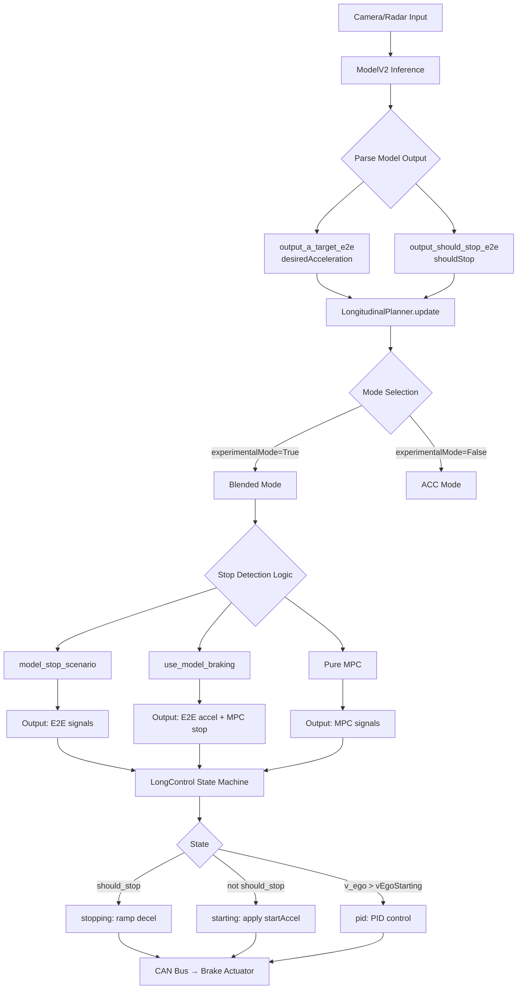
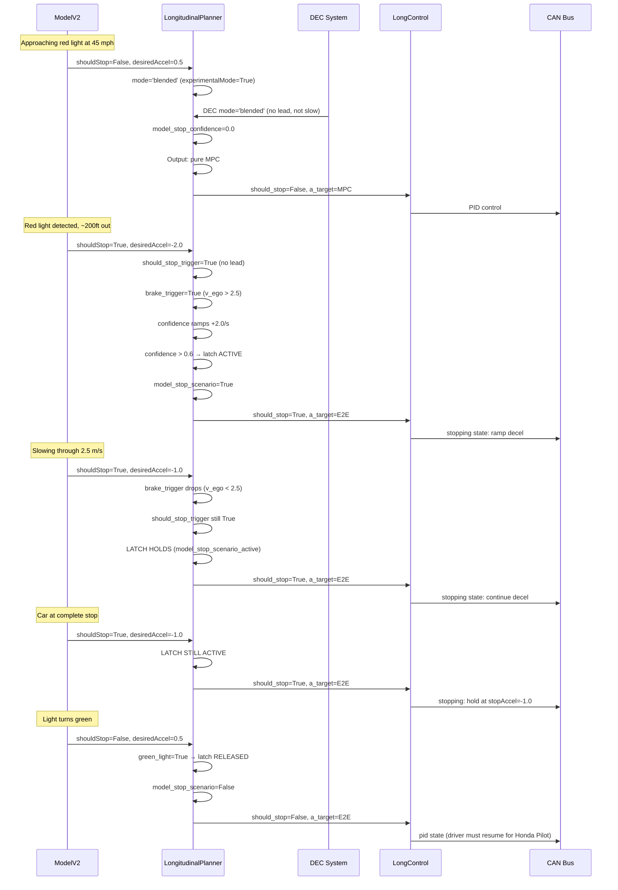

# Stop-Light Detection & Response: Full Pipeline Analysis
## 2019 Honda Pilot — Experimental/Blended Mode

**Analysis Date**: 2026-05-05
**Status**: COMPLETE

---

## 1. Pipeline Overview



---

## 2. Perception Layer: Model Output

### 2.1 Model Inference → Action Parsing

**File**: [`selfdrive/modeld/modeld.py`](selfdrive/modeld/modeld.py)

The model produces a trajectory plan (position, velocity, acceleration arrays of size `TRAJECTORY_SIZE=33`). The function `get_action_from_model()` extracts two key signals:

```python
# From modeld.py - get_action_from_model()
desired_accel, should_stop = get_accel_from_plan(
    model_data.plan.velocities,
    model_data.plan.accelerations,
    model_data.plan.t_idxs,
    action_t=DT_MDL,        # 0.05s
    vEgoStopping=0.05       # hardcoded threshold for MPC stop detection
)
```

### 2.2 `get_accel_from_plan()` — MPC Stop Detection

**File**: [`selfdrive/controls/lib/drive_helpers.py`](selfdrive/controls/lib/drive_helpers.py:42-55)

```python
def get_accel_from_plan(speeds, accels, t_idxs, action_t=DT_MDL, vEgoStopping=0.05):
    v_target = np.interp(action_t, t_idxs, speeds)
    a_target = 2 * (v_target - v_now) / action_t - a_now
    v_target_1sec = np.interp(action_t + 1.0, t_idxs, speeds)
    should_stop = (v_target < vEgoStopping and v_target_1sec < vEgoStopping)
    return a_target, should_stop
```

Key: `should_stop` is True when BOTH the immediate target speed AND the 1-second-ahead target speed are below `vEgoStopping` (0.05 m/s). This is the MPC-level stop signal.

### 2.3 E2E Output Signals

The model publishes two action signals consumed by the planner:

| Signal | Source | Meaning |
|--------|--------|---------|
| `output_a_target_e2e` | `sm['modelV2'].action.desiredAcceleration` | Model's desired acceleration (smoothed) |
| `output_should_stop_e2e` | `sm['modelV2'].action.shouldStop` | Model predicts full stop needed |

These are parsed in [`LongitudinalPlanner.parse_model()`](selfdrive/controls/lib/longitudinal_planner.py:78-95).

---

## 3. Planning Layer: Stop Detection & Decision Logic

**File**: [`selfdrive/controls/lib/longitudinal_planner.py`](selfdrive/controls/lib/longitudinal_planner.py:97-258)

### 3.1 Mode Selection

```python
# Line 98
mode = 'blended' if sm['selfdriveState'].experimentalMode else 'acc'
```

When `experimentalMode` is True → **blended mode** (E2E + MPC fusion).
When False → **ACC mode** (traditional ACC with conditional model braking).

### 3.2 Sunnypilot DEC Override

**File**: [`sunnypilot/selfdrive/controls/lib/longitudinal_planner.py`](sunnypilot/selfdrive/controls/lib/longitudinal_planner.py:44-48)

The `get_mpc_mode` property returns `self.dec.mode()` which can dynamically override the mode:

```python
@property
def get_mpc_mode(self) -> str | None:
    return self.dec.mode()  # 'acc' or 'blended'
```

**DEC Mode Transitions** ([`sunnypilot/selfdrive/controls/lib/dec/dec.py`](sunnypilot/selfdrive/controls/lib/dec/dec.py:305-372)):

| Condition | Radar Mode | Radarless Mode |
|-----------|-----------|---------------|
| MPC FCW active | → blended (emergency) | → blended (emergency) |
| Standstill (>3 frames) | → blended | → blended |
| Slow down detected (urgency > 0.7) | → blended (emergency) | → blended (emergency) |
| Slow down detected (urgency ≤ 0.7) | → blended (normal) | → blended (normal) |
| Lead present (not standstill) | → acc | N/A |
| Driving slow (below cruise) | → acc | → acc |
| Default | → acc | → acc |

**Critical interaction**: When DEC switches to `acc` mode (e.g., lead vehicle present), the blended-mode stop detection latch is bypassed entirely. The ACC-mode logic at lines 108-206 is used instead, which has a simpler `use_model_braking` check without the latch mechanism.

### 3.3 Blended Mode Stop Detection (THE FIX)

**Lines 209-233** — This is the implementation of the plan's proposed fix:

```python
# Speed gate (v_ego > MIN_ALLOW_THROTTLE_SPEED) only applies to the
# desiredAccel trigger — shouldStop is trusted at any speed.
model_wants_to_brake = output_a_target_e2e < -1.5
should_stop_trigger = output_should_stop_e2e and not lead_present
brake_trigger = model_wants_to_brake and not lead_present and v_ego > MIN_ALLOW_THROTTLE_SPEED

if should_stop_trigger or brake_trigger:
    self.model_stop_confidence = min(1.0, self.model_stop_confidence + self.dt * 2.0)
else:
    self.model_stop_confidence = max(0.0, self.model_stop_confidence - self.dt * 3.0)

# Latch: once model_stop_scenario activates, hold it until the model
# explicitly signals green light (shouldStop=False AND desiredAccel >= 0).
if self.model_stop_confidence > 0.6:
    self.model_stop_scenario_active = True
elif self.model_stop_scenario_active:
    # Release only on explicit green light signal
    green_light = not output_should_stop_e2e and output_a_target_e2e >= 0.0
    if green_light:
        self.model_stop_scenario_active = False
model_stop_scenario = self.model_stop_scenario_active
```

**Dual-Trigger System**:

| Trigger | Condition | Speed Gate? |
|---------|-----------|-------------|
| `should_stop_trigger` | `output_should_stop_e2e AND NOT lead_present` | **NO** — trusted at any speed |
| `brake_trigger` | `output_a_target_e2e < -1.5 AND NOT lead_present AND v_ego > 2.5` | **YES** — only above 2.5 m/s |

**Confidence Dynamics**:
- Ramp-up rate: `+2.0 / second`
- Decay rate: `-3.0 / second`
- Activation threshold: `> 0.6`

**Latch Mechanism**:
- Once `model_stop_scenario_active` is set True, it stays True until explicit green light
- Green light condition: `not output_should_stop_e2e AND output_a_target_e2e >= 0.0`
- This prevents the self-defeating condition where confidence decays below 2.5 m/s

### 3.4 Output Selection

**Lines 241-253**:

```python
if model_stop_scenario:
    # Model stop scenario: use E2E signals exclusively
    output_a_target = output_a_target_e2e
    self.output_should_stop = output_should_stop_e2e
elif use_model_braking:
    # Model braking: use E2E accel, MPC shouldStop
    output_a_target = output_a_target_e2e
    self.output_should_stop = output_should_stop_mpc
else:
    # Pure MPC
    output_a_target = min(output_a_target_mpc, output_a_target_e2e)
    self.output_should_stop = output_should_stop_e2e or output_should_stop_mpc
```

### 3.5 ACC Mode Logic (Non-Experimental)

**Lines 108-206** — Used when `experimentalMode` is False OR when DEC overrides to 'acc':

```python
use_model_braking = (v_ego < MIN_ALLOW_THROTTLE_SPEED and
                     output_a_target_e2e < -1.5 and
                     not lead_present)
```

This is a simpler check — no confidence ramp, no latch. Model braking only activates below 2.5 m/s.

---

## 4. Control Layer: LongControl State Machine

**File**: [`selfdrive/controls/lib/longcontrol.py`](selfdrive/controls/lib/longcontrol.py:13-92)

### 4.1 State Transitions

```python
def long_control_state_trans(CP, CP_SP, active, long_control_state, v_ego,
                             should_stop, brake_pressed, cruise_standstill):
    if long_control_state == LongCtrlState.off:
        if active:
            long_control_state = LongCtrlState.pid

    elif long_control_state == LongCtrlState.stopping:
        if should_stop:
            # Remain in stopping
            pass
        else:
            if CP.startingState:
                long_control_state = LongCtrlState.starting
            else:
                long_control_state = LongCtrlState.pid

    elif long_control_state == LongCtrlState.starting:
        if should_stop:
            long_control_state = LongCtrlState.stopping
        elif v_ego > CP.vEgoStarting:
            long_control_state = LongCtrlState.pid

    elif long_control_state == LongCtrlState.pid:
        if should_stop:
            long_control_state = LongCtrlState.stopping
```

### 4.2 State Behaviors

| State | Behavior | Key Parameter |
|-------|----------|---------------|
| `stopping` | Ramp acceleration down toward `stopAccel` | [`CP.stoppingDecelRate = 0.8`](opendbc_repo/opendbc/car/interfaces.py:246) |
| `starting` | Apply `startAccel` to begin moving | `CP.startAccel` (default: 0.0) |
| `pid` | PID control with feedforward | `CP.longitudinalTuning` |

### 4.3 Stopping State Detail

```python
# longcontrol.py lines 76-82
if long_control_state == LongCtrlState.stopping:
    a_target = ramp_rate(a_target, CP.stopAccel, -CP.stoppingDecelRate)
    # a_target ramps toward stopAccel at rate stoppingDecelRate
```

---

## 5. Honda Pilot 2019 — Specific Parameters

### 5.1 Platform Identification

**File**: [`opendbc_repo/opendbc/car/honda/values.py`](opendbc_repo/opendbc/car/honda/values.py:326-335)

```python
HONDA_PILOT = HondaNidecPlatformConfig(
    [HondaCarDocs("Honda Pilot 2016-22", min_steer_speed=12. * CV.MPH_TO_MS),
     HondaCarDocs("Honda Passport 2019-25", "All", min_steer_speed=12. * CV.MPH_TO_MS)],
    HONDA_PILOT_4G.specs,
    radar_dbc_dict('acura_ilx_2016_can_generated'),
    flags=HondaFlags.NIDEC_ALT_SCM_MESSAGES | HondaFlags.HAS_ALL_DOOR_STATES,
)
```

- **Platform**: NIDEC (not Bosch)
- **Has radar**: Yes (NIDEC platform uses radar)
- **`openpilotLongitudinalControl = True`**
- **`pcmCruise = True`**

### 5.2 Longitudinal Parameters

From [`opendbc_repo/opendbc/car/interfaces.py`](opendbc_repo/opendbc/car/interfaces.py:245-248) (`get_std_params()` defaults, NOT overridden by Honda NIDEC):

| Parameter | Value | Notes |
|-----------|-------|-------|
| `stopAccel` | **-1.0** | Reduced from -2.0 specifically for Honda Pilot to "eliminate brake noise" |
| `stoppingDecelRate` | **0.8** | Brake_travel/s while trying to stop |
| `vEgoStopping` | **0.5** m/s | Speed threshold for "stopped" |
| `vEgoStarting` | **0.5** m/s | Speed threshold for "started moving" |
| `startAccel` | **0.0** (default) | Acceleration to apply when starting from stop |
| `startingState` | **False** (default) | Whether to use the `starting` state |
| `longitudinalActuatorDelay` | **0.15** s | Actuator delay |
| `autoResumeSng` | **False** | Car cannot auto-resume from stop |
| `minEnableSpeed` | **~11.4 m/s (~25.5 mph)** | Minimum speed to engage openpilot |

### 5.3 Longitudinal PID Tuning

From [`opendbc_repo/opendbc/car/honda/interface.py`](opendbc_repo/opendbc/car/honda/interface.py:92-94):

```python
# default longitudinal tuning for all hondas
ret.longitudinalTuning.kiBP = [0., 5., 35.]
ret.longitudinalTuning.kiV = [1.2, 0.8, 0.5]
```

### 5.4 NIDEC Acceleration Limits

From [`opendbc_repo/opendbc/car/honda/values.py`](opendbc_repo/opendbc/car/honda/values.py:22-23):

```python
NIDEC_ACCEL_MIN = -4.0  # m/s^2
NIDEC_ACCEL_MAX = 1.6   # m/s^2
```

### 5.5 Key Behavioral Implications

1. **No auto-resume**: After stopping at a red light, the driver MUST press resume or accelerator to start moving. The `startingState = False` means the car skips the `starting` state and goes directly to `pid` control.

2. **High minEnableSpeed**: openpilot cannot be engaged below ~25.5 mph. Once engaged, it can slow to a stop.

3. **Reduced stopAccel**: -1.0 m/s² (vs typical -2.0) means less braking force when holding at a stop. May cause roll on steep hills.

4. **No Hyundai-style tuning**: Honda does NOT use the `get_longitudinal_tune()` system from [`opendbc_repo/opendbc/sunnypilot/car/hyundai/longitudinal/helpers.py`](opendbc_repo/opendbc/sunnypilot/car/hyundai/longitudinal/helpers.py). That system is Hyundai-only.

---

## 6. Comparison: Plan Document vs Implementation

### 6.1 Plan Document Summary

**File**: [`.claude/plan/stop_light_detection_fix.md`](.claude/plan/stop_light_detection_fix.md)

The plan identifies:
- **Root Cause**: `v_ego > MIN_ALLOW_THROTTLE_SPEED` gate at line 209 creates a self-defeating condition where confidence decays below 2.5 m/s, preventing the car from coming to a complete stop
- **Proposed Fix**: Dual-trigger system (shouldStop at any speed + desiredAccel with speed gate) + latch mechanism
- **Status**: Marked "✅ IMPLEMENTED — 2026-05-05"

### 6.2 Implementation Match

| Plan Requirement | Code Location | Status |
|-----------------|---------------|--------|
| `should_stop_trigger` with NO speed gate | [`longitudinal_planner.py:211`](selfdrive/controls/lib/longitudinal_planner.py:211) | ✅ MATCH |
| `brake_trigger` WITH speed gate (`v_ego > 2.5`) | [`longitudinal_planner.py:212`](selfdrive/controls/lib/longitudinal_planner.py:212) | ✅ MATCH |
| Confidence ramp-up +2.0/s | [`longitudinal_planner.py:215`](selfdrive/controls/lib/longitudinal_planner.py:215) | ✅ MATCH |
| Confidence decay -3.0/s | [`longitudinal_planner.py:217`](selfdrive/controls/lib/longitudinal_planner.py:217) | ✅ MATCH |
| Threshold at 0.6 | [`longitudinal_planner.py:222`](selfdrive/controls/lib/longitudinal_planner.py:222) | ✅ MATCH |
| Latch mechanism (`model_stop_scenario_active`) | [`longitudinal_planner.py:223-231`](selfdrive/controls/lib/longitudinal_planner.py:223-231) | ✅ MATCH |
| Green light release: `not shouldStop AND accel >= 0` | [`longitudinal_planner.py:228`](selfdrive/controls/lib/longitudinal_planner.py:228) | ✅ MATCH |
| New field `model_stop_scenario_active` in `__init__` | [`longitudinal_planner.py:70`](selfdrive/controls/lib/longitudinal_planner.py:70) | ✅ MATCH |
| `lead_present` gate on both triggers | [`longitudinal_planner.py:211-212`](selfdrive/controls/lib/longitudinal_planner.py:211-212) | ✅ MATCH |

### 6.3 Discrepancies & Concerns

#### 6.3.1 DEC Mode Switching Bypasses the Latch

**Severity**: MEDIUM

When the DEC (Dynamic Experimental Control) system switches the mode from `'blended'` to `'acc'` (e.g., when a lead vehicle appears), the entire latch-based stop detection is bypassed. The ACC-mode logic at lines 108-206 uses a simpler check:

```python
use_model_braking = (v_ego < MIN_ALLOW_THROTTLE_SPEED and
                     output_a_target_e2e < -1.5 and not lead_present)
```

This has NO confidence ramp, NO latch, and requires `v_ego < 2.5` to activate. If DEC switches to `acc` mode while approaching a red light (e.g., a lead vehicle cuts in), the stop detection may fail.

**Mitigation**: DEC's `_radar_mode()` prioritizes `acc` when a lead is present (line 346-348), but the slow-down detection can override to `blended` (lines 351-358). The interaction is complex and depends on timing.

#### 6.3.2 Honda Pilot `autoResumeSng = False`

**Severity**: LOW (by design)

The Honda Pilot 2019 cannot auto-resume from a stop. This is a hardware limitation of the NIDEC platform, not a code bug. The plan document does not address this — it focuses solely on the stopping behavior. After a successful stop at a red light, the driver must manually resume.

#### 6.3.3 `stopAccel = -1.0` for Honda Pilot

**Severity**: LOW

The comment at [`interfaces.py:245`](opendbc_repo/opendbc/car/interfaces.py:245) says this was reduced from -2.0 to -1.0 "for honda pilot to eliminate brake noise." This means the car holds with less braking force at standstill. On steep inclines, the car might roll slightly. This is unrelated to the stop-detection fix but affects the holding phase.

#### 6.3.4 No `startingState` for Honda Pilot

**Severity**: LOW (by design)

Since `CP.startingState` defaults to `False` and Honda NIDEC doesn't override it, the LongControl state machine skips the `starting` state. The car goes directly from `stopping` → `pid` when `should_stop` becomes False. This means `CP.startAccel` is never applied. Combined with `autoResumeSng = False`, this means the driver must always intervene to resume from a stop.

#### 6.3.5 Plan Document Edge Case: Lead Cutting In

**Severity**: LOW (addressed in plan)

The plan document Section 5.1 discusses the concern of a lead vehicle cutting in during a model stop scenario. The implementation handles this via the `lead_present` gate on both triggers — if a lead appears, the triggers deactivate. However, the LATCH remains active until explicit green light. This means:

- If a lead cuts in while `model_stop_scenario_active` is True, the latch holds
- The car continues to use E2E signals (which may now account for the lead)
- The latch only releases on `not shouldStop AND accel >= 0`

This is the intended behavior per the plan.

---

## 7. Complete State Trace: Approaching a Red Light



---

## 8. Summary of Findings

### What Works Correctly

1. The dual-trigger + latch fix from the plan is **fully implemented** and matches the design exactly
2. The `shouldStop` trigger has no speed gate, allowing stop detection at any speed
3. The latch mechanism correctly holds through the low-speed zone where confidence would otherwise decay
4. Green light release uses the correct condition: `not shouldStop AND accel >= 0`
5. Lead presence gates work correctly on both triggers

### Areas of Concern

1. **DEC interaction**: When DEC switches to `acc` mode, the latch is bypassed. This could cause missed stops if a lead vehicle appears during approach to a red light
2. **Honda Pilot hardware limitations**: No auto-resume, high minEnableSpeed — these are platform constraints, not bugs
3. **Reduced stopAccel**: -1.0 m/s² may be insufficient for hill holding

### Recommendation

The core stop-detection fix is correctly implemented. The primary risk area is the DEC interaction. Consider adding a mechanism to prevent DEC from switching away from `blended` mode when `model_stop_scenario_active` is True, or extending the latch logic to the ACC-mode path.
